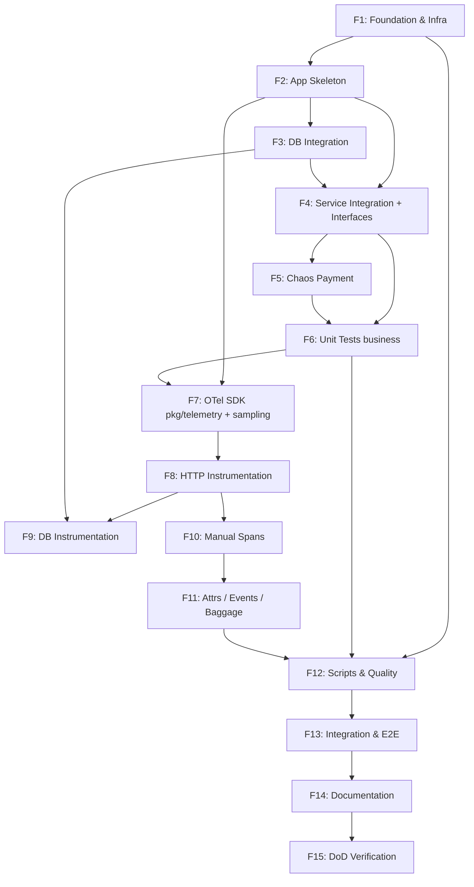

# OTel-Shop Lab — Detailed Implementation Plan (Revised)

PRD source: [prd.md](file:///Users/muhammad.indragiri/Kerja/otel-shop/prd.md)

**Status:** Revised v2 — decisions locked, gaps closed  
**Date:** 2026-08-25

---

## Ringkasan

PRD membangun **3 microservices Golang** (Order, Inventory, Payment) dengan **OpenTelemetry distributed tracing**, di-deploy ke **k3d Kubernetes**, dengan full code quality pipeline.

Plan memecah PRD menjadi **~70 task atomic** (~55 ⚡ Flash / ~15 🧠 Capable) yang masing-masing single-responsibility, self-contained, dan testable.

---

## Locked Decisions

> Keputusan di bawah **wajib** diikuti semua task. Tidak ada open question tersisa.

| # | Topik | Keputusan | Alasan |
|---|-------|-----------|--------|
| D1 | **Go module path** | `github.com/otel-shop/order`, `github.com/otel-shop/inventory`, `github.com/otel-shop/payment`, `github.com/otel-shop/telemetry` | Lab sederhana, path pendek, konsisten |
| D2 | **HTTP router** | Go **1.22+** `net/http` ServeMux (`GET /inventory/{id}`) | Zero extra dependency; path param native |
| D3 | **Go version** | `1.22` (minimum di semua `go.mod`) | Butuh enhanced ServeMux |
| D4 | **Shared OTel package** | Module terpisah `pkg/telemetry` → `github.com/otel-shop/telemetry` | Satu kali implement, 3 service import; masuk `go.work` |
| D5 | **DB stack** | `database/sql` + `github.com/jackc/pgx/v5/stdlib` + `github.com/XSAM/otelsql` | Stdlib-compatible, otelsql auto DB spans |
| D6 | **OTel SDK** | `go.opentelemetry.io/otel` **v1.32+** (stable); pin matching `otelhttp`, `otlptracegrpc`, `sdk` | API stabil; samakan minor di semua module |
| D7 | **Propagators** | Composite: **W3C TraceContext + W3C Baggage** | PRD §17 + §22 |
| D8 | **Collector → Jaeger** | Collector export **OTLP** ke Jaeger all-in-one (OTLP gRPC). **Jangan** pakai jaeger exporter deprecated | Stack modern, tetap sesuai intent PRD §14 |
| D9 | **Payment amount** | Order mengirim `amount = qty * 10` (unit price tetap 10) | Contract jelas untuk test & span attrs |
| D10 | **OTLP failure** | Exporter non-blocking; timeout singkat; **business logic tetap jalan** jika Collector down | NFR Reliability PRD §40 |
| D11 | **Sampling env** | `OTEL_TRACES_SAMPLER_ARG` (float 0.0–1.0, default `1.0`) dibaca di `pkg/telemetry` init | Digabung ke OTel init, bukan fase terpisah |
| D12 | **Interface boundaries** | Order: `InventoryClient`, `PaymentClient`. Inventory: `StockStore`. Payment chaos: injectable config | Unit test tanpa network/DB/collector |
| D13 | **Coverage gate** | `go test ./internal/... -cover` **≥ 70%** per service business packages | PRD §28, AC-014 |
| D14 | **Container runtime** | **Podman** (sesuai PRD); scripts pakai `podman` | PRD header |
| D15 | **Image naming** | `otel-shop/order:local`, `otel-shop/inventory:local`, `otel-shop/payment:local` | Konsisten untuk k3d import |

### Version pins (referensi)

Saat `go get`, target kisaran (sesuaikan patch terbaru yang kompatibel):

```text
go 1.22
go.opentelemetry.io/otel                    v1.32.0+
go.opentelemetry.io/otel/sdk                v1.32.0+
go.opentelemetry.io/otel/exporters/otlp/otlptrace/otlptracegrpc  v1.32.0+
go.opentelemetry.io/contrib/instrumentation/net/http/otelhttp     v0.57.0+
github.com/XSAM/otelsql                     v0.35.0+
github.com/jackc/pgx/v5                     v5.7.0+
```

Collector image: `otel/opentelemetry-collector-contrib` (recent stable).  
Jaeger image: `jaegertracing/all-in-one` (recent stable, OTLP enabled default).

---

## Prinsip Pembagian Task

| Prinsip | Penjelasan |
|---------|------------|
| **Single Responsibility** | 1 task = 1 file atau 1 concern |
| **No Ambiguity** | Keputusan arsitektur sudah di **Locked Decisions** |
| **Self-Contained** | Input/output + acceptance jelas |
| **Testable** | Acceptance bisa diverifikasi (build/test/dry-run) |
| **Interface first** | Dependency lewat interface sebelum unit test |

> 🧠 = model capable · ⚡ = model murah (Flash/Haiku)

---

## Fase 1 — Project Foundation & Infrastructure Config

### 1.1 Project Scaffolding

| # | Task | Model | Input | Output | Acceptance |
|---|------|-------|-------|--------|------------|
| 1.1.1 | ⚡ Buat directory structure sesuai PRD §37 + `pkg/telemetry/` | Flash | PRD §37 + D4 | Folder tree | Tree memuat `services/{order,inventory,payment}`, `deploy/*`, `db/`, `scripts/`, `docs/`, `pkg/telemetry/` |
| 1.1.2 | ⚡ Init `go.mod` `services/order` → `github.com/otel-shop/order` | Flash | D1, D3 | `services/order/go.mod` | `go list -m` valid |
| 1.1.3 | ⚡ Init `go.mod` `services/inventory` → `github.com/otel-shop/inventory` | Flash | D1, D3 | `go.mod` | Valid |
| 1.1.4 | ⚡ Init `go.mod` `services/payment` → `github.com/otel-shop/payment` | Flash | D1, D3 | `go.mod` | Valid |
| 1.1.5 | ⚡ Init `go.mod` `pkg/telemetry` → `github.com/otel-shop/telemetry` | Flash | D1, D3, D4 | `pkg/telemetry/go.mod` | Valid |
| 1.1.6 | ⚡ Buat `go.work` memuat 4 module di atas | Flash | 1.1.2–1.1.5 | `go.work` | `go work sync` sukses |
| 1.1.7 | ⚡ Buat `.golangci.yml` | Flash | PRD §26 | Config | Parseable oleh golangci-lint |
| 1.1.8 | ⚡ Buat `db/init.sql` — schema `products` + seed A123/B123/C123 | Flash | PRD §11 | SQL file | Valid SQL |
| 1.1.9 | ⚡ Buat `README.md` skeleton (title, ports table placeholder, link PRD) | Flash | PRD overview | README | Readable |

### 1.2 Kubernetes & Infrastructure Manifests

| # | Task | Model | Input | Output | Acceptance |
|---|------|-------|-------|--------|------------|
| 1.2.1 | ⚡ Buat `deploy/namespace.yaml` — namespace `otel-shop` | Flash | PRD §33 | YAML | `kubectl apply --dry-run=client` OK |
| 1.2.2 | ⚡ Buat `deploy/postgres/configmap.yaml` — mount sumber dari `db/init.sql` (atau embed SQL) | Flash | PRD §11 | ConfigMap | Dry-run OK |
| 1.2.3 | ⚡ Buat `deploy/postgres/deployment.yaml` — Postgres, port **15432** container/service | Flash | PRD §5, §11 | Deployment | Dry-run OK |
| 1.2.4 | ⚡ Buat `deploy/postgres/service.yaml` — `postgres:15432` | Flash | PRD §33 | Service | Dry-run OK |
| 1.2.5 | 🧠 Buat `deploy/otel-collector/configmap.yaml` — pipeline: OTLP recv → batch → **otlp exporter ke jaeger:4317** | Opus | D8, PRD §14, ports 14317/14318 | Collector config | YAML valid; **bukan** jaeger exporter deprecated |
| 1.2.6 | ⚡ Buat `deploy/otel-collector/deployment.yaml` + `service.yaml` — ports 14317 (gRPC), 14318 (HTTP) | Flash | PRD §5, §14 | deploy/otel-collector/ | Dry-run OK |
| 1.2.7 | ⚡ Buat `deploy/jaeger/deployment.yaml` + `service.yaml` — all-in-one, UI **16686**, OTLP 4317 internal | Flash | D8, PRD §5 | deploy/jaeger/ | Dry-run OK |
| 1.2.8 | ⚡ Buat `scripts/cluster.sh` — k3d create + port-map 18080,18081,18082,15432,14317,14318,16686 | Flash | PRD §5 | Script | Executable, idempotent notes di header |

---

## Fase 2 — Application Skeleton (3 Services)

> Pattern: `cmd/main.go` + `internal/handler/` + `internal/model/`. Router = stdlib ServeMux (D2).

### 2.1 Order Service Skeleton

| # | Task | Model | Input | Output | Acceptance |
|---|------|-------|-------|--------|------------|
| 2.1.1 | ⚡ Buat `services/order/internal/model/order.go` — `CheckoutRequest`, `CheckoutResponse`, `ErrorResponse` | Flash | PRD §9 | model | Compiles |
| 2.1.2 | ⚡ Buat `services/order/internal/handler/health.go` — `GET /health` → 200 | Flash | PRD §10 | handler | Compiles |
| 2.1.3 | ⚡ Buat `services/order/internal/handler/checkout.go` — stub `POST /checkout`, parse JSON, dummy 200 `{order_id, status:paid}` | Flash | PRD §6, D9 | handler | Compiles |
| 2.1.4 | ⚡ Buat `services/order/cmd/main.go` — listen `:PORT` default 18080, register routes | Flash | PRD §6, §36 | main | `go build ./...` |
| 2.1.5 | ⚡ Buat `services/order/Dockerfile` — multi-stage, scratch/distroless | Flash | PRD §35, D15 | Dockerfile | Syntax valid |

### 2.2 Inventory Service Skeleton

| # | Task | Model | Input | Output | Acceptance |
|---|------|-------|-------|--------|------------|
| 2.2.1 | ⚡ Buat `services/inventory/internal/model/inventory.go` — `InventoryResponse` | Flash | PRD §9 | model | Compiles |
| 2.2.2 | ⚡ Buat `services/inventory/internal/handler/health.go` | Flash | PRD §10 | handler | Compiles |
| 2.2.3 | ⚡ Buat `services/inventory/internal/handler/inventory.go` — stub `GET /inventory/{id}` → `{stock:10}` | Flash | PRD §7, D2 | handler | Compiles; path `{id}` |
| 2.2.4 | ⚡ Buat `services/inventory/cmd/main.go` — port default 18081 | Flash | PRD §7, §36 | main | `go build` |
| 2.2.5 | ⚡ Buat `services/inventory/Dockerfile` | Flash | PRD §35, D15 | Dockerfile | Valid |

### 2.3 Payment Service Skeleton

| # | Task | Model | Input | Output | Acceptance |
|---|------|-------|-------|--------|------------|
| 2.3.1 | ⚡ Buat `services/payment/internal/model/payment.go` — `PayRequest`, `PayResponse` | Flash | PRD §8, §9 | model | Compiles |
| 2.3.2 | ⚡ Buat `services/payment/internal/handler/health.go` | Flash | PRD §10 | handler | Compiles |
| 2.3.3 | ⚡ Buat `services/payment/internal/handler/payment.go` — stub `POST /pay` → `{status:success}` | Flash | PRD §8 | handler | Compiles |
| 2.3.4 | ⚡ Buat `services/payment/cmd/main.go` — port default 18082 | Flash | PRD §8, §36 | main | `go build` |
| 2.3.5 | ⚡ Buat `services/payment/Dockerfile` | Flash | PRD §35, D15 | Dockerfile | Valid |

### 2.4 Kubernetes Deployment untuk Services

| # | Task | Model | Input | Output | Acceptance |
|---|------|-------|-------|--------|------------|
| 2.4.1 | ⚡ Buat `deploy/order/deployment.yaml` + `service.yaml` — port 18080, env PRD §36 | Flash | PRD §36, D15 | YAML | Dry-run OK |
| 2.4.2 | ⚡ Buat `deploy/inventory/deployment.yaml` + `service.yaml` — 18081 + `DATABASE_URL` | Flash | PRD §36 | YAML | Dry-run OK |
| 2.4.3 | ⚡ Buat `deploy/payment/deployment.yaml` + `service.yaml` — 18082 + chaos env defaults | Flash | PRD §36, §24 | YAML | Dry-run OK |

---

## Fase 3 — Database Integration (Inventory ↔ PostgreSQL)

| # | Task | Model | Input | Output | Acceptance |
|---|------|-------|-------|--------|------------|
| 3.1 | ⚡ Buat `services/inventory/internal/store/store.go` — interface `StockStore` dengan `GetStock(ctx, id) (int, error)` | Flash | D12 | interface file | Compiles |
| 3.2 | ⚡ Buat `services/inventory/internal/db/db.go` — `Open(ctx, databaseURL) (*sql.DB, error)` via **pgx stdlib** (belum otelsql) | Flash | D5, PRD §36 | db.go | Compiles; deps di go.mod |
| 3.3 | ⚡ Buat `services/inventory/internal/db/product.go` — `ProductStore` implements `StockStore`; `QueryRowContext` + `sql.ErrNoRows` → not found | Flash | PRD §11, 3.1 | product.go | Compiles |
| 3.4 | ⚡ Update inventory handler — inject `StockStore`, 200/404/500 sesuai error | Flash | 3.1, 3.3 | handler | Compiles |
| 3.5 | ⚡ Update inventory `main.go` — open DB, wire store, defer close | Flash | 3.2–3.4 | main | `go build` |

---

## Fase 4 — Service Integration (Order → Inventory + Payment)

| # | Task | Model | Input | Output | Acceptance |
|---|------|-------|-------|--------|------------|
| 4.1 | ⚡ Buat `services/order/internal/client/interfaces.go` — `InventoryClient`, `PaymentClient` interfaces | Flash | D12, PRD §7–8 | interfaces | Compiles |
| 4.2 | ⚡ Buat `services/order/internal/client/inventory.go` — HTTP GET `{base}/inventory/{id}` | Flash | PRD §7, 4.1 | client | Compiles |
| 4.3 | ⚡ Buat `services/order/internal/client/payment.go` — HTTP POST `{base}/pay` | Flash | PRD §8, 4.1 | client | Compiles |
| 4.4 | ⚡ Buat `services/order/internal/model/errors.go` — typed errors (validation, inventory, payment, stock) | Flash | PRD §9 | errors.go | Compiles |
| 4.5 | 🧠 Wire full checkout di `checkout.go`: validate → gen order_id → inventory → stock≥qty → payment `amount=qty*10` → response; map 404/500 | Opus | PRD §6, D9, 4.1–4.4 | handler | Logic lengkap; depends on interfaces |
| 4.6 | ⚡ Update order `main.go` — env `INVENTORY_URL`, `PAYMENT_URL`, wire clients + handler | Flash | PRD §36 | main | `go build` |

---

## Fase 5 — Chaos Engineering (Payment Service)

| # | Task | Model | Input | Output | Acceptance |
|---|------|-------|-------|--------|------------|
| 5.1 | ⚡ Buat `services/payment/internal/chaos/chaos.go` — `Config` dari env; `Apply(ctx) error` (delay + probabilistic error) | Flash | PRD §24 | chaos.go | Compiles; deterministic jika percent 0/100 |
| 5.2 | ⚡ Update payment handler — panggil chaos sebelum success response; error → 500 `{status:failed}` | Flash | 5.1, PRD §8 | handler | Compiles |
| 5.3 | ⚡ Update payment `main.go` — load chaos config dari env | Flash | PRD §36 | main | `go build` |

---

## Fase 6 — Unit Testing (Business Logic First)

> Dijalankan **sebelum** OTel agar test tidak tergantung collector. Handler boleh create span nanti dengan global TracerProvider (noop default di test).

| # | Task | Model | Input | Output | Acceptance |
|---|------|-------|-------|--------|------------|
| 6.1 | 🧠 `services/order/internal/handler/checkout_test.go` — mock InventoryClient + PaymentClient: success, invalid req, inventory fail, payment fail, insufficient stock | Opus | PRD §27, 4.5 | tests | `go test` pass |
| 6.2 | ⚡ `services/inventory/internal/handler/inventory_test.go` — mock StockStore: exists, not found, db error | Flash | PRD §27 | tests | Pass |
| 6.3 | ⚡ `services/inventory/internal/db/product_test.go` — test GetStock dengan sqlmock **atau** skip+interface-only jika sqlmock dihindari; minimal table-driven pada wrapper error mapping | Flash | PRD §27 | tests | Pass |
| 6.4 | ⚡ `services/payment/internal/chaos/chaos_test.go` — delay 100%/0%, error 100%/0% | Flash | PRD §27 | tests | Pass |
| 6.5 | ⚡ `services/payment/internal/handler/payment_test.go` — success, forced error via chaos config | Flash | PRD §27 | tests | Pass |
| 6.6 | ⚡ Coverage gate: jalankan `go test ./internal/... -cover` tiap service; **fail jika internal < 70%** | Flash | D13 | catatan di scripts nanti; manual verify sekarang | ≥70% pada package business |

---

## Fase 7 — OpenTelemetry SDK Setup (`pkg/telemetry`)

> Sampling (ex-F11) **digabung** di sini (D11).

| # | Task | Model | Input | Output | Acceptance |
|---|------|-------|-------|--------|------------|
| 7.1 | 🧠 Implement `pkg/telemetry/telemetry.go` — `Init(ctx, serviceName, version) (shutdown func, error)`: Resource (`service.name`, `service.version`, `deployment.environment=lab`), OTLP gRPC exporter (`OTEL_EXPORTER_OTLP_ENDPOINT`), ParentBased+TraceIDRatioFromEnv (`OTEL_TRACES_SAMPLER_ARG` default 1.0), composite TraceContext+Baggage, batcher dengan timeout wajar (D10) | Opus | D4–D7, D10–D11, PRD §12–13, §23 | package | `go build` di module telemetry |
| 7.2 | ⚡ Tambah OTel deps ke `pkg/telemetry/go.mod` (pin D6) + `go work sync` | Flash | D6 | go.mod | Sync OK |
| 7.3 | ⚡ Apply init di `services/order/cmd/main.go` — `order-service`, defer shutdown | Flash | 7.1, PRD §12 | main | Compiles; require telemetry module |
| 7.4 | ⚡ Apply init di `services/inventory/cmd/main.go` — `inventory-service` | Flash | 7.1 | main | Compiles |
| 7.5 | ⚡ Apply init di `services/payment/cmd/main.go` — `payment-service` | Flash | 7.1 | main | Compiles |

---

## Fase 8 — HTTP Instrumentation & Context Propagation

| # | Task | Model | Input | Output | Acceptance |
|---|------|-------|-------|--------|------------|
| 8.1 | 🧠 Wrap Order mux dengan `otelhttp` (server); pastikan route/span name berguna | Opus | PRD §15, §17 | order main | Compiles |
| 8.2 | ⚡ otelhttp server middleware — Inventory | Flash | 8.1 pattern | main | Same pattern |
| 8.3 | ⚡ otelhttp server middleware — Payment | Flash | 8.1 pattern | main | Same pattern |
| 8.4 | 🧠 Order HTTP clients: `otelhttp.NewTransport` pada `http.Client`; propagasi `traceparent`+baggage | Opus | PRD §16–17, D7 | clients | Compiles |
| 8.5 | ⚡ Pastikan checkout + clients thread `context.Context` dari `r.Context()` | Flash | 8.4, 4.5 | checkout/clients | ctx tidak di-drop |

---

## Fase 9 — Database Instrumentation

| # | Task | Model | Input | Output | Acceptance |
|---|------|-------|-------|--------|------------|
| 9.1 | 🧠 Wrap DB open dengan **otelsql** + pgx driver name; attributes DB system PostgreSQL | Opus | D5, PRD §7 target, §11 | db.go | Compiles; otelsql dep |
| 9.2 | ⚡ Verify `GetStock` memakai `QueryRowContext(ctx, ...)` | Flash | PRD §11 | product.go | ctx propagated |

---

## Fase 10 — Manual Instrumentation (Custom Business Spans)

| # | Task | Model | Input | Output | Acceptance |
|---|------|-------|-------|--------|------------|
| 10.1 | ⚡ Span `validate-order` di checkout — attrs `order.id`, `order.item_id`, `order.quantity` | Flash | PRD §18–19 | checkout.go | Span + attrs |
| 10.2 | ⚡ Span `check-inventory` wrapping inventory call — attrs `product.id`, `product.stock` | Flash | PRD §18–19 | checkout.go | Span + attrs |
| 10.3 | ⚡ Span `process-payment` wrapping payment call — attrs `payment.order_id`, `payment.amount`, `payment.status` | Flash | PRD §18–19 | checkout.go | Span + attrs |

---

## Fase 11 — Span Attributes, Events, Status & Baggage

| # | Task | Model | Input | Output | Acceptance |
|---|------|-------|-------|--------|------------|
| 11.1 | ⚡ Finalize Order span attributes (lengkapi sisa dari F10) | Flash | PRD §19 | checkout | Complete attrs |
| 11.2 | ⚡ Inventory handler attrs: `product.id`, `product.stock` | Flash | PRD §19 | handler | Set on span |
| 11.3 | ⚡ Payment handler attrs: `payment.order_id`, `payment.amount`, `payment.status` | Flash | PRD §19 | handler | Set on span |
| 11.4 | ⚡ Payment events: `payment_started`, `payment_completed`, `payment_failed` | Flash | PRD §20 | handler | Events recorded |
| 11.5 | ⚡ Payment HTTP 500 → span status ERROR + `RecordError` | Flash | PRD §21 | handler | Error status |
| 11.6 | 🧠 Baggage: Order set `order.id` → clients propagate → Inventory & Payment read + optional attr | Opus | PRD §22, D7 | order + inv + pay | Baggage readable downstream |
| 11.7 | ⚡ Order handler: pada downstream failure, set span status ERROR + record error | Flash | PRD §21 | checkout | Error recorded |

---

## Fase 12 — Scripts & Quality Pipeline

| # | Task | Model | Input | Output | Acceptance |
|---|------|-------|-------|--------|------------|
| 12.1 | ⚡ `scripts/check.sh` — per module: `gofmt -l` (fail if dirty), `go vet`, `golangci-lint`, `go test ./... -cover`, **enforce ≥70% pada `./internal/...`** | Flash | PRD §32, D13 | Script | Executable; exits non-zero on fail |
| 12.2 | ⚡ `scripts/build.sh` — `podman build` 3 images (D14, D15) | Flash | PRD §35 | Script | Executable |
| 12.3 | ⚡ `scripts/deploy.sh` — apply namespace → infra → apps; wait ready | Flash | deploy/ tree | Script | Executable |
| 12.4 | ⚡ `scripts/test.sh` — E2E: 3× health + POST checkout + assert body | Flash | PRD §30 | Script | Executable |
| 12.5 | ⚡ `scripts/chaos-test.sh` — ERROR_PERCENT=100 expect fail; DELAY 100% expect ~2s (atau document manual scale) | Flash | PRD §31 | Script | Executable |

---

## Fase 13 — Integration & E2E Testing

| # | Task | Model | Input | Output | Acceptance |
|---|------|-------|-------|--------|------------|
| 13.1 | 🧠 Integration tests — Order→Inventory→Payment: success, inventory not found, payment error (httptest atau process-local) | Opus | PRD §29 | `tests/integration/` atau per-service `..._integration_test.go` | Pass dengan test servers |
| 13.2 | ⚡ Verifikasi `scripts/test.sh` + `scripts/chaos-test.sh` terhadap cluster (manual/CI notes) | Flash | PRD §30–31 | docs di script header | Scenarios tercakup |

---

## Fase 14 — Documentation

| # | Task | Model | Input | Output | Acceptance |
|---|------|-------|-------|--------|------------|
| 14.1 | ⚡ `docs/tracing-examples.md` — expected traces normal / slow / error (PRD §46) | Flash | PRD §46 | Doc | Readable |
| 14.2 | ⚡ `docs/experiments.md` — eksperimen §43: propagation on/off, payment bottleneck, DB bottleneck, error chain, sampling 100% vs 10%, collector failure | Flash | PRD §43, output #20 | Doc | Semua 6 eksperimen ada langkah + expected |
| 14.3 | ⚡ Finalize `README.md` — prerequisites (Go 1.22, Podman, k3d, kubectl), quickstart, architecture, ports, commands, troubleshooting pointer | Flash | PRD overview, DoD | README | Complete |

---

## Fase 15 — Definition of Done Checklist (Verification)

Bukan coding task baru — **gate final** sebelum project DONE (PRD §45):

| # | Check | Cara verifikasi |
|---|-------|-----------------|
| 15.1 | Cluster + PG + Collector + Jaeger up | `kubectl -n otel-shop get pods` |
| 15.2 | 3 services `/health` → 200 | `./scripts/test.sh` (health bagian) |
| 15.3 | Checkout sukses | POST `/checkout` item A123 |
| 15.4 | Satu Trace ID lintas Order/Inv/Pay | Jaeger UI |
| 15.5 | DB child span di Inventory | Jaeger |
| 15.6 | Manual spans validate/check/process | Jaeger |
| 15.7 | Attributes + events + baggage | Jaeger |
| 15.8 | Sampling 1.0 vs 0.1 observable | Ubah env, restart, bandingkan volume |
| 15.9 | Payment delay ~2s & error 500 di waterfall | chaos-test / env |
| 15.10 | Collector down → app masih checkout (best effort) | Scale collector 0, retry checkout |
| 15.11 | `./scripts/check.sh` hijau + coverage ≥70% | Script |
| 15.12 | Integration + E2E + chaos scripts | Scripts |
| 15.13 | Rebuild/redeploy dari repo bersih | cluster → build → deploy → test |

---

## Dependency Graph



### Parallelism hints

- Setelah F2: F3 dan awal F4 clients bisa paralel; checkout wire (4.5) butuh F3 hanya jika ingin E2E lokal — **tidak** wajib untuk unit test order (mock).
- F7 bisa disiapkan parallel setelah F2 (pkg/telemetry), apply ke main setelah F6 agar test tetap sederhana.
- F10–F11 sequential di checkout file yang sama — hindari conflict.

---

## Ringkasan Model Allocation

| Model | ~Count | Contoh |
|-------|--------|--------|
| ⚡ Flash/Haiku | ~55 | Scaffold, YAML split, stubs, clients, chaos, attrs, scripts, simple tests, docs |
| 🧠 Capable | ~15 | Collector OTLP pipeline, checkout wire, telemetry.Init, otelhttp server/client, otelsql, baggage, order tests, integration tests |

---

## Mapping PRD Milestone → Plan Fase

| PRD Fase | Plan |
|----------|------|
| 1 Infrastruktur | F1 |
| 2 App skeleton | F2 |
| 3 Database | F3 |
| 4 Code quality & unit test | F6 + F12.1 |
| 5 Basic OTel | F7 |
| 6 HTTP instrumentation | F8 |
| 7 DB instrumentation | F9 |
| 8 Manual instrumentation | F10 |
| 9 Attrs/events/baggage | F11 |
| 10 Chaos | F5 (+ observe after F8) |
| 11 Integration & E2E | F13 |
| 12 Validation & troubleshooting | F14.2 experiments + F15 |

---

## Verification Plan

### Automated

```bash
./scripts/check.sh          # fmt, vet, lint, test, coverage ≥70%
./scripts/build.sh          # podman images
./scripts/cluster.sh        # k3d (sekali)
./scripts/deploy.sh         # manifests
./scripts/test.sh           # E2E happy path
./scripts/chaos-test.sh     # error + delay scenarios
```

### Manual (Jaeger `http://localhost:16686`)

- POST `/checkout` → satu distributed trace parent/child
- Attributes, events, baggage `order.id`
- Chaos delay ≈2s di waterfall; error span status
- Sampling dan collector-down experiment (docs/experiments.md)

---

## Perubahan dari Plan v1 (changelog)

1. **Open Questions → Locked Decisions** (D1–D15).
2. **Shared module** `pkg/telemetry` eksplisit + go.work 4 module.
3. **Router**: Go 1.22 stdlib, bukan chi.
4. **DB**: pgx stdlib + otelsql (bukan ambigu).
5. **Collector**: OTLP → Jaeger, bukan jaeger exporter deprecated.
6. **Postgres manifests di-split** (1.2.2–1.2.4).
7. **Interfaces** sebelum unit test (3.1, 4.1).
8. **Unit tests digeser sebelum OTel** (F6 sebelum F7).
9. **Sampling digabung ke OTel init** (bukan fase terpisah).
10. **Coverage ≥70% gate** di check.sh + task 6.6.
11. **Payment amount policy** `qty * 10` (D9).
12. **OTLP non-blocking / app survives collector down** (D10, 15.10).
13. **docs/experiments.md** untuk PRD §43 (14.2).
14. **chaos-test.sh** terpisah (12.5).
15. **Fase DoD verification** eksplisit (F15).
16. Dependency graph di-update sesuai urutan baru.

---

## Catatan eksekusi untuk agent

1. Baca **Locked Decisions** sebelum setiap task.
2. Jangan menambah dependency di luar D5/D6 tanpa update plan.
3. Jangan commit secret; `DATABASE_URL` hanya via env/K8s.
4. Setelah menambah module/deps: `go work sync` + build ketiga service.
5. Task 🧠 selesai dulu sebelum cascade ⚡ copy-pattern ke service lain.
